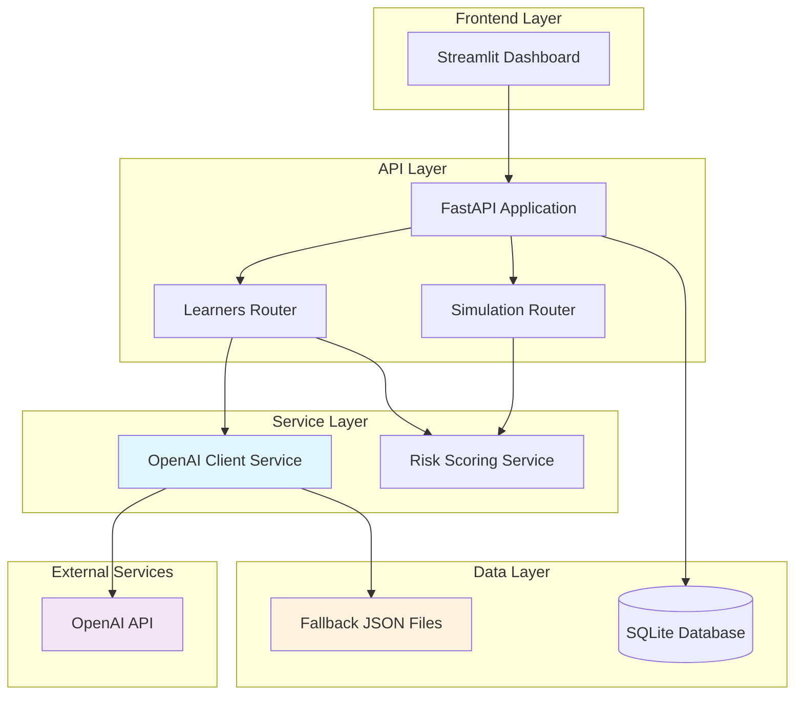

# Design Document

## Overview

The Learner Engagement Platform is built as a microservices-style architecture with a FastAPI backend providing REST APIs, a Streamlit dashboard for administration, and SQLite for data persistence. The system integrates with OpenAI's API for intelligent content generation while maintaining robust fallback mechanisms for reliability.

The architecture prioritizes rapid development and deployment suitable for hackathon environments while maintaining production-ready patterns like async operations, proper error handling, and comprehensive testing.

## Architecture



## Components and Interfaces

### 1. FastAPI Application Core (`app.py`)

**Purpose:** Main application entry point with middleware, routing, and lifecycle management.

**Key Features:**
- Async SQLAlchemy engine initialization on startup
- CORS middleware for local development
- Health check endpoint for monitoring
- Router registration for modular endpoint organization

**Interface:**
```python
# Startup event
async def create_tables() -> None

# Health endpoint
GET /api/health -> {"status": "ok", "time": str}
```

### 2. Database Models (`models.py`)

**Purpose:** SQLAlchemy ORM models defining the data schema.

**Models:**
- **Learner**: Core learner profile with engagement metrics
- **Nudge**: Generated interventions with metadata
- **Event**: Learner activity tracking

**Key Design Decisions:**
- String primary keys for easier CSV import and debugging
- Async SQLAlchemy for non-blocking database operations
- JSON metadata fields for flexible event tracking
- Foreign key relationships with proper cascading

### 3. Risk Scoring Service (`lib/risk.py`)

**Purpose:** Deterministic risk assessment algorithm with batch processing capabilities.

**Algorithm:**
```
risk_score = clamp(
    0.5 * (1 - completed_percent/100) +
    0.2 * (1 - avg_quiz_score/100) +
    0.2 * min(consecutive_missed_sessions/7, 1) +
    0.1 * recency_factor,
    0, 1
)

risk_label = "high" if score > 0.7 else "medium" if score > 0.4 else "low"
```

**Interface:**
```python
def compute_risk(learner: dict) -> dict
def compute_and_update_all(learners: list[dict]) -> list[dict]
```

### 4. OpenAI Client Service (`services/openai_client.py`)

**Purpose:** Intelligent content generation with comprehensive fallback mechanisms.

**Fallback Strategy:**
1. Primary: OpenAI API with 8-second timeout
2. Fallback: Local JSON templates when API unavailable
3. Error handling: Graceful degradation with clear indicators

**Interface:**
```python
async def generate_nudge(context: dict) -> dict
async def generate_quiz(context: dict) -> dict
```

**Response Format:**
```json
{
    "content": "Generated content",
    "prompt_version": "v1.0",
    "gptFallback": false
}
```

### 5. API Routers (`routers/learners.py`)

**Purpose:** RESTful endpoints for learner management and interventions.

**Endpoints:**
- `GET /api/learners` - List learners with risk filtering
- `GET /api/learners/{id}` - Individual learner details
- `POST /api/learners/{id}/nudge` - Generate personalized nudge
- `POST /api/learners/{id}/quiz` - Generate quiz content
- `POST /api/simulate/run` - Batch risk recalculation

**Validation:**
- Pydantic models for request/response validation
- Channel validation for nudge types
- Defensive error handling with appropriate HTTP codes

### 6. Streamlit Dashboard (`dashboard/app.py`)

**Purpose:** Administrative interface for monitoring and manual interventions.

**Features:**
- Real-time learner risk visualization
- Manual nudge generation with immediate feedback
- Clear fallback indicators for simulated responses
- Configurable API endpoint for different environments

## Data Models

### Learner Model
```python
class Learner(Base):
    id: str (PK)
    name: str
    email: str (unique)
    phone: str
    program: str
    last_login: str (ISO format)
    completed_percent: float
    avg_quiz_score: float
    consecutive_missed_sessions: int
    risk_score: float (computed)
    risk_label: str (computed)
```

### Nudge Model
```python
class Nudge(Base):
    id: str (PK)
    learner_id: str (FK)
    channel: str (in-app|whatsapp|email)
    type: str
    content: text
    gpt_prompt_version: str
    status: str
    created_at: datetime
```

### Event Model
```python
class Event(Base):
    id: str (PK)
    learner_id: str (FK)
    type: str
    metadata: JSON
    timestamp: datetime
```

## Error Handling

### API Error Responses
- **400 Bad Request**: Invalid input validation
- **404 Not Found**: Learner or resource not found
- **500 Internal Server Error**: Unexpected system errors
- **200 OK with fallback flag**: Graceful degradation scenarios

### Fallback Mechanisms
1. **OpenAI API Failures**: Automatic fallback to local templates
2. **Database Connectivity**: Proper connection pooling and retry logic
3. **Missing Environment Variables**: Sensible defaults where possible
4. **Invalid Data**: Defensive parsing with default values

### Logging Strategy
- Console logging for development
- Structured error messages without sensitive data exposure
- Clear distinction between expected fallbacks and actual errors

## Testing Strategy

### Unit Tests
- **Risk Calculation**: Verify algorithm with known inputs/outputs
- **Data Validation**: Test Pydantic models and edge cases
- **Fallback Logic**: Ensure graceful degradation works correctly

### Integration Tests
- **API Endpoints**: Full request/response cycle testing
- **Database Operations**: CRUD operations and data integrity
- **OpenAI Integration**: Mock API responses and timeout handling

### Test Data
- Deterministic test cases for risk scoring
- Mock learner profiles covering edge cases
- Sample fallback content for offline testing

### CI/CD Pipeline
- Automated test execution on push/PR
- Python environment setup (3.10/3.11)
- Optional linting with flake8
- Fast feedback loop for development

## Security Considerations

### API Security
- Input validation on all endpoints
- SQL injection prevention through ORM
- CORS configuration for development/production

### Data Protection
- Environment variable management for secrets
- No sensitive data in logs or error messages
- Secure handling of OpenAI API keys

### Development Security
- `.env.example` template without real credentials
- `.gitignore` configuration for sensitive files
- Clear separation of development and production configs

## Performance Considerations

### Database Optimization
- Async SQLAlchemy for non-blocking operations
- Proper indexing on frequently queried fields
- Batch operations for risk score updates

### API Performance
- Async request handling throughout
- Configurable timeouts for external services
- Efficient data serialization with Pydantic

### Scalability Patterns
- Stateless API design for horizontal scaling
- Database connection pooling
- Caching opportunities for risk scores (future enhancement)

## Deployment Architecture

### Development Environment
- Local SQLite database for simplicity
- Hot reload for rapid iteration
- Separate ports for backend (8000) and dashboard (8501)

### Production Considerations
- Environment-specific configuration
- Database migration strategy with Alembic
- Container deployment with Docker
- Health check endpoints for load balancers